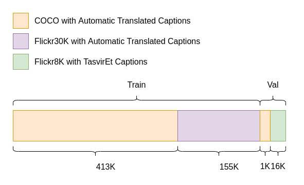

# Turkish Image Captioning
This repository contains the project I worked on during my internship at Somera

## Installing dependencies 
First clone the repository and change directory
```bash
$ git clone https://github.com/badayvedat/turkish-image-captioning.git
$ cd turkish-image-captioning
```

Install dependencies. Installing on an isolated environment such as venv or conda is preferred.
```bash
$ pip install -r requirements.txt
```

## Training
### Preparing dataset


All of TasvirEt dataset used in validation. Because unlike COCO and Flickr30K captions, TasvirEt is not automatically translated, making it a better choice for validation. 

Download and create dataset
```bash
$ sh data/download_data.sh
```

Make COCO dataset
```bash
$ python3 data/coco.py
```

Make Flickr30k dataset
```bash
$ python3 data/flickr30k.py

```

Make Flickr8k dataset
```bash
$ python3 data/flickr8k.py
```

### Running training code
Create a config file with necessary parameters.
For example config files check `configs/` folder.

```bash
$ python3 train.py configs/12heads20kvoc.yaml
```

Run `python3 train.py -h` to see all parameters.

Also, you can use train.ipynb notebook.

## Usage - Testing
Download config file, pre-trained weights and vocabulary file.
Move weights file to `checkpoints/` folder. 
Currently only jpg files are supported.

### Using Dockerfile
```bash
$ docker build -t turkish-caption .
$ docker run -p 6006:6006 turkish-caption
```

### Using Flask
```bash
$ cd app
$ flask run
```

### Using on Command Line
```bash
$ python3 evaluate.py path_to_image
```
Run `python3 evaluate.py -h` to see all parameters.
